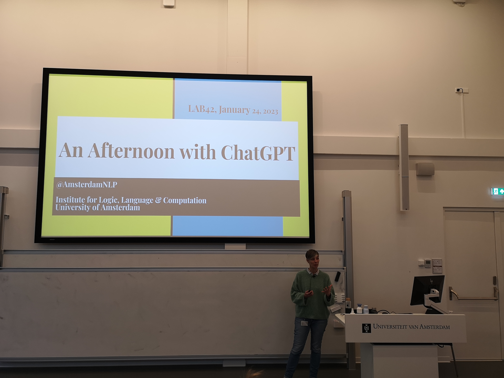
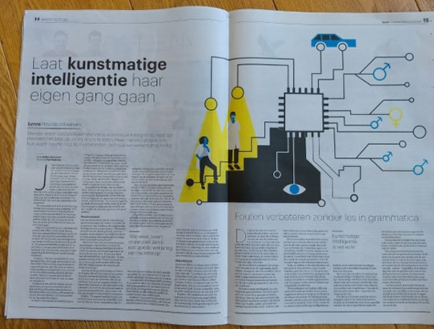

There is much research on Large Language Models happening in Amsterdam. Because of the great attention for and both excitement and concern about large language models in society and the media, we have here collected a selection of recent research and media reports of Amsterdam-based work in this area.
*Er gebeurt veel onderzoek over gigantische taalmodellen (Large Language Models, Foundation Models) in Amsterdam. Vanwege de grote recente interesse in dit soort modellen, en de zorgen daarover in de maatschappij, hebben we hier een selectie van onderzoek en journalistieke en wetenschappelijke publicaties op een rijtje gezet.*

## Links to other resources
- University of Amsterdam's [Language Sciences for Social Good](https://language-science.nl/) initiative, a consortium of 30 researchers across the language sciences. 
- Recent media appearances [ILLC People in the Media](https://www.illc.uva.nl/Media/In-the-media/current/)

## Evi-Anne van Dis, Johan Bollen, Robert van Rooij, Jelle Zuidema and Claudi Bockting (2023)
Opinion article in Nature on how researchers should respond to developments in 'conversational AI'

- Press release *Persbericht UvA*: [link](https://www.uva.nl/content/nieuws/nieuwsberichten/2023/02/chatgpt-in-de-wetenschap-5-aandachtspunten.html?origin=C7qo0vSuQiCeMfPYaosIew)
- Publication: van Dis, E. A., Bollen, J., Zuidema, W., van Rooij, R., & Bockting, C. L. (2023). ChatGPT: five priorities for research. Nature, 614(7947), 224-226. [Article](https://www.nature.com/articles/d41586-023-00288-7)

## Raquel Fernández, Jelle Zuidema, Jelke Bloem, Sandro Pezzelle, Ece Takmaz, Mario Giulianelli (2023)
"An Afternoon with ChatGPT" -- Public lectures on ChatGPT

- Recording
[Recording](https://webcolleges.uva.nl/Mediasite/Play/03f5830f6e804ad68e9ec8ba6612d8d81d)

## Arabella Sinclair, Jaap Jumelet, Willem Zuidema, Raquel Fernández (2022)
Research on how much knowledge of grammar is acquired by large language models.
*Onderzoek naar hoeveel kennis van grammatica-regels taalmodellen hebben geleerd.*

- Blog post 
[ILLC Blog](https://resources.illc.uva.nl/illc-blog/probing-by-priming-what-do-large-language-models-know-about-grammar/)

- Scientific publication: 
Arabella Sinclair, Jaap Jumelet, Willem Zuidema, Raquel Fernández; Structural Persistence in Language Models: Priming as a Window into Abstract Language Representations. Transactions of the Association for Computational Linguistics 2022; 10 1031–1050. [doi](https://doi.org/10.1162/tacl_a_00504) [arxiv](https://arxiv.org/abs/2109.14989)

## Oskar van der Wal, Dominik Bachmann, Alina Leidinger, Leendert van Maanen, Willem Zuidema, Katrin Schulz (2022)
Research on undesirable biases in Large Language Models and how they can be measured and mitigated.
*Onderzoek naar ongewenste biases in taalmodellen en hoe we die kunnen meten en voorkomen.*

- Scientific publication:  
Oskar van der Wal, Dominik Bachmann, Alina Leidinger, Leendert van Maanen, Willem Zuidema, Katrin Schulz (2022), Undesirable biases in NLP: Averting a crisis of measurement. [arxiv](https://arxiv.org/abs/2211.13709)

## Oskar van der Wal, Jaap Jumelet, Katrin Schulz, Willem Zuidema 
Research on the evolution of undesirable biases in Large Language Models during training.
*Onderzoek naar het ontstaan van ongewenste biases in grote taalmodellen.*

- [Blog post](https://odvanderwal.nl/2022/birth-of-bias.html)
- Scientific publication:  
Oskar van der Wal, Jaap Jumelet, Katrin Schulz, Willem Zuidema (2022), The Birth of Bias: A case study on the evolution of gender bias in an English language model. [arxiv](https://arxiv.org/abs/2207.10245)

## Dieuwke Hupkes, Jaap Jumelet, Mario Giulianelli & 441 other authors (2022)
The BigBench test suit for quantifying the performance of Large Language Models.

- [Blog post](https://medium.com/syncedreview/444-authors-from-132-institutions-release-big-bench-a-204-task-extremely-difficult-and-diverse-4633ec6e741e) (on Medium)
- Scientific publication:
Srivastava et al. (2022), Beyond the Imitation Game: Quantifying and extrapolating the capabilities of language models. [arxiv](https://arxiv.org/abs/2206.04615)

## Oskar van der Wal & 390 other authors (2022)
The multilingual, open-source language model Bloom, created and trained by the Big Science consortium.
*Het veeltalige, open-source taalmodel BLOOM van het Big Science consortium.*

- Scientific publication: 
BigScience Workshop et al., BLOOM: A 176B-Parameter Open-Access Multilingual Language Model, 2022.
[arxiv](https://arxiv.org/abs/2211.05100)

## Rochelle Choeni, Ekaterina Shutova & Robert van Rooij (2021) 
Onderzoek naar (ongewenste) stereotypen die opduiken in taalmodellen en zoekmachines.

- Persbericht *Press release*
[UvA persberichten](https://www.uva.nl/content/nieuws/persberichten/2021/11/welke-stereotypen-zitten-ingebakken-in-ai-taalmodellen.html?origin=8geT2goFTZSNjbHsS7pkaQ)
- [Artikel in the Volkskrant](https://www.volkskrant.nl/wetenschap/hoe-stereotypen-in-de-zoekmachine-belanden-en-er-moeilijk-uit-te-halen-zijn~b98f4662/)
- Scientific publication: 
Stepmothers are mean and academics are pretentious: What do pretrained language models learn about you? Gepresenteerd op de 2021 Conference on Empirical Methods in Natural Language Processing (EMNLP2021), 7 november 2021. [ACL Anthology](https://aclanthology.org/2021.emnlp-main.111/).

## Dieuwke Hupkes and Jelle Zuidema (2020)
Interviewed by Dutch national newspaper Trouw about the emerging field of interpretability research.
*Interview in Trouw over de geboorte van een nieuw vakgebied: interpretability van taalmodellen en andere deep learning modellen.*

[Trouw article by Willem Schoonen](https://dieuwkehupkes.nl/Trouw-29-08-2020-article.pdf)
